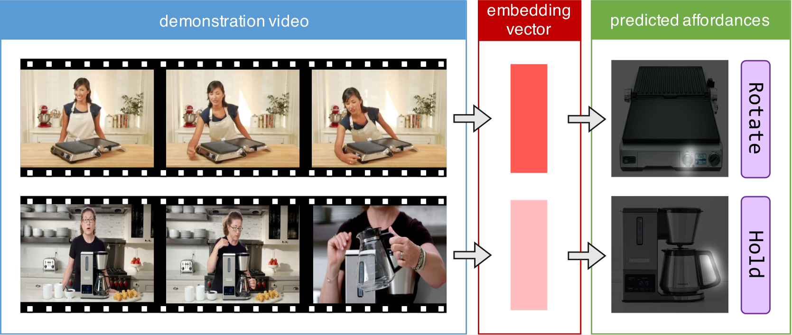

# OPRA Dataset: Online Product Reviews for Affordances

**[Kuan Fang*](ai.stanford.edu/~kuanfang/), [Te-Lin Wu*](telinwu@usc.edu), [Daniel Yang](https://www.linkedin.com/in/dxyang/), [Silvio Savarese](http://svl.stanford.edu/people) and [Joseph J. Lim](http://www-bcf.usc.edu/~limjj/)**

For questions regarding OPRA Dataset please contact Kuan Fang and Te-Lin Wu.

### Introduction
The OPRA Dataset was introduced in our [Demo2Vec paper](http://ai.stanford.edu/~kuanfang/pdf/demo2vec2018cvpr) for reasoning object affordances from online demonstration videos. It contains 11,505 demonstration clips and 2,512 object images scraped from 6 popular YouTube product review channels along with the corresponding affordance annotations. More details can be found on our [website](https://sites.google.com/view/demo2vec/).

<p align="center"></p>

### Citation
```
@inproceedings{demo2vec2018cvpr,
author = {Fang, Kuan and Wu, Te-Lin and Yang, Daniel and Savarese, Silvio and Lim, Joseph J.},
title = {Demo2Vec: Reasoning Object Affordances From Online Videos},
booktitle = {The IEEE Conference on Computer Vision and Pattern Recognition (CVPR)},
month = {June},
year = {2018}
}
```

### Requirements

Install [youtube-dl](https://github.com/rg3/youtube-dl):
```Shell
sudo -H pip install --upgrade youtube-dl
```

Install [ffmpeg](https://www.ffmpeg.org/):
```Shell
sudo add-apt-repository ppa:mc3man/trusty-media  
sudo apt-get update  
sudo apt-get install ffmpeg  
```

To visualize the dataset using Jupyter notebooks, these packages need to be installed: [NumPy](https://scipy.org/install.html), [OpenCV](https://docs.opencv.org/3.4.1/d2/de6/tutorial_py_setup_in_ubuntu.html), [Matplotlib](https://matplotlib.org/users/installing.html), [Jupyter](http://jupyter.org/install).

### Usage

One can follow the step-by-step instructions below or just run the bash script `bash ./get_dataset.sh`.

Download and unzip `data/` (around 500MB). The folder contains playlists of YouTube product review videos (`playlists/`), product images (`images/`), and human annotations of the video segmentation and interactiion regions (`annotations/`).
```Shell
wget ftp://cs.stanford.edu/cs/cvgl/OPRA/data.zip
unzip data.zip
```

Download the product review videos from YouTube (around 51GB). (Note that some of the url may be no longer valid when you run the script, because they have been deleted from the playlist or due to other technical issues.)
```Shell
python download.py --playlist data/playlists --output data/raw_videos/
```

Segment the videos according to the annotations  (around 13GB). After segmentation, raw videos will be no longer needed and can be removed.
```Shell
python segment.py --annotations data/annotations/train.txt --raw data/raw_videos/ --output data/clips
python segment.py --annotations data/annotations/test.txt --raw data/raw_videos/ --output data/clips
```

### Demo

We provide a simple demo for loading and visualizing the dataset. Please run the Jupyter notebook:
```Shell
jupyter notebook

# Or run remotely. 
jupyter notebook --no-browser --port=8888
```

Open `./notebooks/visualize_annotations.ipynb` in the browser (Chrome and FireFox are recommended) at this [link](http://localhost:8888/notebooks/notebooks/visualize_annotations.ipynb). The notebook provide a basic demo of loading the dataset and visualizing the video clip, the target image, and the annotation.
